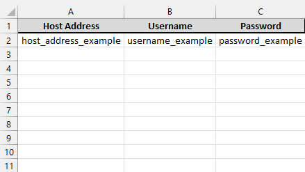

# Rdp Shortcut Maker

## About The Project

This program make a rdp shortcut for each and every entry in the Excel file given.
The created shortcuts will be placed in the same folder as the Excel file with a name as follows:

`{folder name}-{host address}-{username}.rdp`

The Excel file must follow the exact layout shown below:



Please find a [tutorial](#how-to-launch-program) in the [Demo](./Demo) folder if needed

## Getting Started

_The following commands are all done directly from the base directory of the project._

### Prerequisites

* You will need [python](https://www.python.org/downloads/) installed.
  (<i>Latest is recommended</i>)
* You will need to have all the libraries installed
```sh
  pip install -r requirements.txt
  ```

### How to Launch Program

_This is a demonstration with the [Excel](./Demo/Demo%20-%20List%20connection%20RDP.xlsx) file found in the [Demo](./Demo) folder. Also please close the Excel file before starting the prog_

1. Run the python script
```sh
  python .\main.py
```

2. Give the directory or direct path to the wanted Excel file
```sh
.\Demo
```

3. All shortcuts created are in the [Demo](./Demo) folder next to your given Excel file


4. Double click your wanted rdp file in order the run the Remote Desktop Connection
